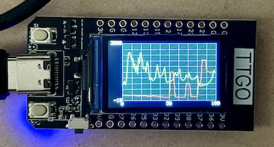

# TTGO_Solar_Graph
On a Lilygo TTGO ESP32 board draw a graph of power generated and used from an Enphase controller

Gets solar generation and usage values from an Enphase solar controller.
  Draws a graph with a red line for use and a green line for generated.
  I'm using IDE 2.0.0-rc9.2 but v1 should work too.

  You'll need to install the ESP32 board files.

  The following Libraries will be needed:
  * TFT_eSPI
  * TFT_eWidget
  * ArduinoJson by Benoit
  


## Wifi Credentials

You'll need to create a file in the same directory as the ino file called
"WifiCredentials.h" that contains:

```
const char *kWifiNetwork = "SSID";
const char *kWifiPassword = "PASSWORD";
```

